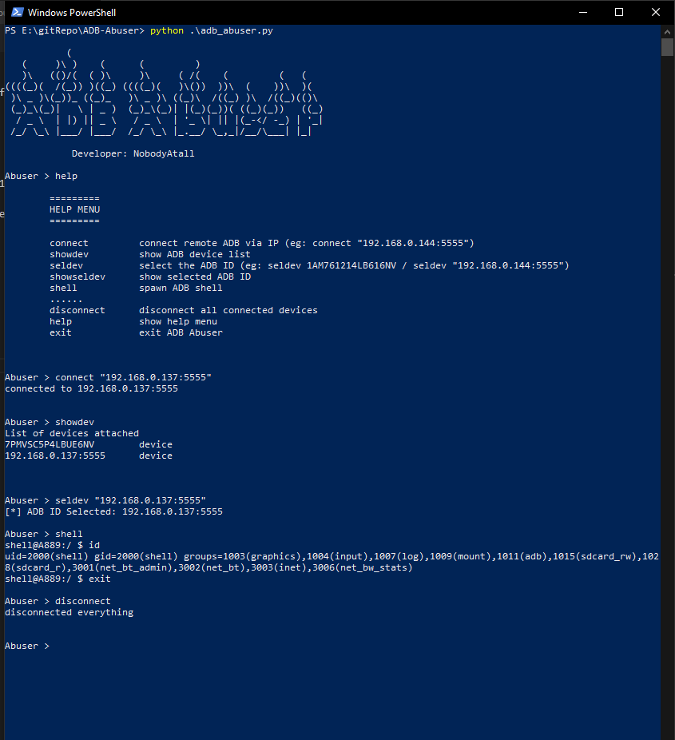

# ADB Abuser
 ADB Abuser make ADB pentesting life easier

 ### WARNING!! More Features will be addon, stay tune.

  ## Image


 ## Help Menu
 ```
 connect         connect remote ADB via IP (eg: connect "192.168.0.144:5555")
 showdev         show ADB device list
 seldev          select the ADB ID (eg: seldev 1AM761214LB616NV / seldev "192.168.0.144:5555")
 showseldev      show selected ADB ID
 shell           spawn ADB shell      
 ......
 disconnect      disconnect all connected devices
 help            show help menu
 exit            exit ADB Abuser 
 ```

